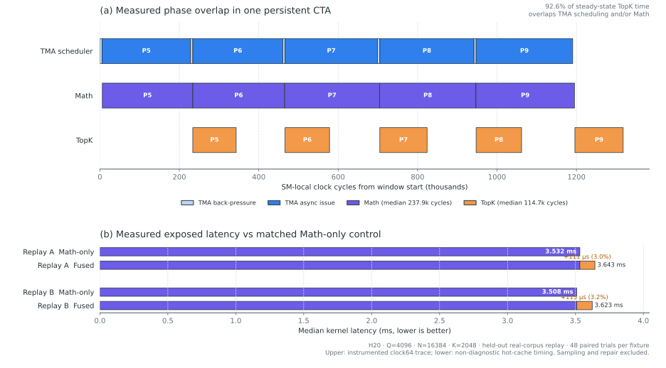

# FusedIndexTopK

FusedIndexTopK is an exact, unordered Top-K operator for the DeepSeek V3.2
indexer workload on NVIDIA Hopper GPUs. It keeps score production and the
normal Top-K path in one kernel, so a dense `Q × N` score matrix is never
materialized.

The current release targets:

- FP8 MQA indexer inputs compatible with the pinned DeepGEMM revision
- `Q = 4096`, `K = 2048`, and `8192 <= N <= 163840`
- SM90/H20
- exact Top-K membership, including ties at the selection threshold

## What is fused

The main kernel combines tensor-core score production, threshold filtering,
candidate collection, radix selection, and final result emission. Candidates
remain in CTA shared memory. Long-context execution has a small bounded spill
workspace; the consumer merges that spill while later math work is still in
flight. A separate sampled-GEMM prepass estimates the threshold, and a
device-masked exact repair path handles the uncommon rows that fail the fast
path.

The normal path therefore has zero dense-score traffic and no full candidate
list in global memory. Long-context overflow may use only the bounded spill
described in [Architecture](docs/ARCHITECTURE.md) and
[Repair analysis](docs/REPAIR_ANALYSIS.md).

### Pipeline overlap

Each persistent CTA assigns one warp to TMA, eight warps to tensor-core math,
and three warps to exact Top-K. Double-buffered candidate slots and ready/free
barriers let math produce query pair `i` while Top-K consumes pair `i - 1`;
TMA continues feeding the math pipeline independently.



This figure is drawn to scale from an H20 run at `Q=4096`, `N=16384`, and
`K=2048` using held-out real-corpus replay. The upper panel shows five measured
steady-state iterations from one persistent CTA; unequal block widths are the
observed `clock64` intervals. Across the complete steady-state trace, **92.6%**
of Top-K time overlaps TMA scheduling and/or tensor-core math. Median phase
windows were 238.1k cycles for the TMA scheduler, 237.9k for math, and 114.7k
for Top-K.

The lower panel is a separate, non-diagnostic paired measurement: fused latency
was only 111 us (3.0%) above Math-only on replay A and 115 us (3.2%) above it
on replay B. Each result is the median of 48 paired hot-cache trials. Sampling
and repair are excluded so the comparison isolates the normal fused path.

The TMA interval includes scheduler back-pressure and asynchronous issue time;
it is not exclusive TMA-engine residency. Diagnostic timestamps are used only
to locate overlap, while formal latency comes from the non-diagnostic runs. The
orange segment in the lower panel is the observed end-to-end delta, not a claim
that Top-K is an isolated serial stage. The compact measurements and trace
qualification are available in
[the pipeline evidence JSON](results/fused-index-topk-pipeline-overlap-h20.json).


| Property | DeepGEMM + FlashInfer | DeepGEMM + DeepSelect | FusedIndexTopK |
|---|---|---|---|
| Score production | DeepGEMM kernel | DeepGEMM kernel | fused main kernel |
| Dense `Q × N` scores | written to GMEM | written to GMEM | not materialized |
| Exact Top-K | separate kernel | separate kernel | same CTA consumer |
| Normal candidate list in GMEM | n/a | n/a | none; bounded overflow spill only |
| Exceptional rows | handled by Top-K kernel | handled by Top-K kernel | device-masked exact repair |

## H20 results

The published campaign used 120 native-length, held-out real-corpus cases:
five model layers, two difficulty splits, two fixtures per split, and six
context lengths. Every case matched an independent exact reference.

| N | DeepGEMM + DeepSelect | FusedIndexTopK | Paired change | Wins |
|---:|---:|---:|---:|---:|
| 8K | 1.887 ms | 1.881 ms | -0.33% | 17/20 |
| 16K | 4.280 ms | 3.883 ms | -9.27% | 20/20 |
| 32K | 8.721 ms | 7.893 ms | -9.49% | 20/20 |
| 64K | 17.170 ms | 16.087 ms | -6.31% | 20/20 |
| 128K | 33.831 ms | 32.540 ms | -3.82% | 20/20 |
| 160K | 41.979 ms | 40.591 ms | -3.31% | 19/20 |


Lower is better. Version 2.1 won 116 of 120 paired cases: all 80 cases from
16K through 128K, 19 of 20 at 160K, and 17 of 20 at 8K. The 8K mean advantage
is only 0.33%, so it should be treated as near parity rather than a robust
speedup claim.

Two independently qualified baseline tracks are available:

| Baseline track | Workload and implementation generation | Evidence |
|---|---|---|
| DeepGEMM + DeepSelect | current 2.1.0; real corpus, 8K–160K | 116/120 wins overall; 80/80 at 16K–128K |
| DeepGEMM + FlashInfer | previous short-context release; real corpus, 6K–16K | 40/40 wins; median CUPTI reduction 14.71% |
| DeepGEMM + FlashInfer | previous long-context development run; layer 0, 32K–128K | six of six cells faster by 4.87%–7.77% |

The FlashInfer rows are historical qualification results from an earlier fused
implementation, not a cross-run estimate for 2.1.0. They are shown to document
both baseline families without pretending that measurements from different
campaigns are directly interchangeable. A fresh three-way campaign is required
for a current head-to-head ranking. The compact provenance record is
[fused-index-topk-baseline-comparison-h20.json](results/fused-index-topk-baseline-comparison-h20.json).

These are operator measurements, not end-to-end TTFT, TPOT, or TPS claims.
Full measurements and provenance are in
[the release artifact](results/fused-index-topk-real-corpus-h20-v2.1.json) and
[Results](docs/RESULTS.md).

## Repository layout

```text
src/fused_index_topk/
  kernel/                     fused operator and CUDA sources
  variants/deepgemm_deepselect/
                              frozen baseline adapter
  api.py, config.py, ...      benchmark and validation framework
configs/
  fused_index_topk_h20.json   qualified H20 matrix
scripts/
  setup_h20.sh                reproducible environment setup
  evaluate_h20.sh             correctness and timing campaign
  benchmark_real_replay.py    real-corpus replay entry point
docs/                         design, method, and results
results/                      small, reviewable release summaries
```

The repository contains release code and compact evidence only. It does not
include model weights, captured tensors, build caches, profiler reports, or
private experiment history.

## Installation

The qualified environment uses CUDA 13.0, PyTorch 2.10.0+cu130, H20, and the
frozen DeepGEMM and DeepSelect revisions listed in
[THIRD_PARTY.md](THIRD_PARTY.md).

```bash
git clone https://github.com/EdgePro001/FusedIndexTopK.git
cd FusedIndexTopK
scripts/setup_h20.sh
```

By default, dependencies and JIT artifacts are stored under
`${XDG_CACHE_HOME:-$HOME/.cache}/fused-index-topk`. Set
`ITK_RUNTIME_ROOT` to choose another location.

Run the public qualification matrix:

```bash
make check
make bench
```

List registered implementations:

```bash
fused-index-topk list
```

Programmatic loading:

```python
from fused_index_topk.registry import load_variant

operator = load_variant("fused_index_topk")
```

## Reproducibility

The harness records source hashes, upstream commit IDs, device properties,
variant options, input seeds, timing protocol, and exactness checks. Real-corpus
tensors are not redistributed; their manifests are identified by SHA-256 so an
authorized holder can verify that the same capture set was replayed.

Before interpreting performance, read [Methodology](docs/METHODOLOGY.md).
Results outside the qualified hardware, software, and workload envelope require
new validation.

## License

FusedIndexTopK is released under the MIT License. Upstream dependencies retain
their own licenses; see [THIRD_PARTY.md](THIRD_PARTY.md) and [NOTICE](NOTICE).
