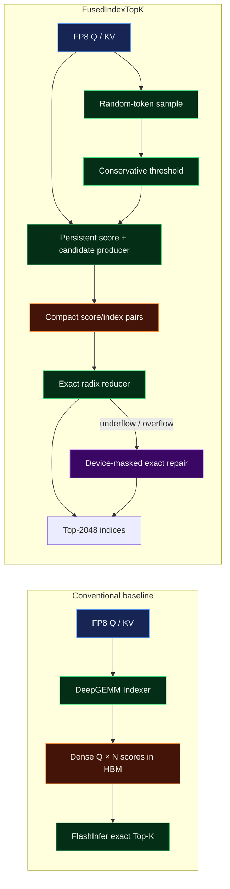
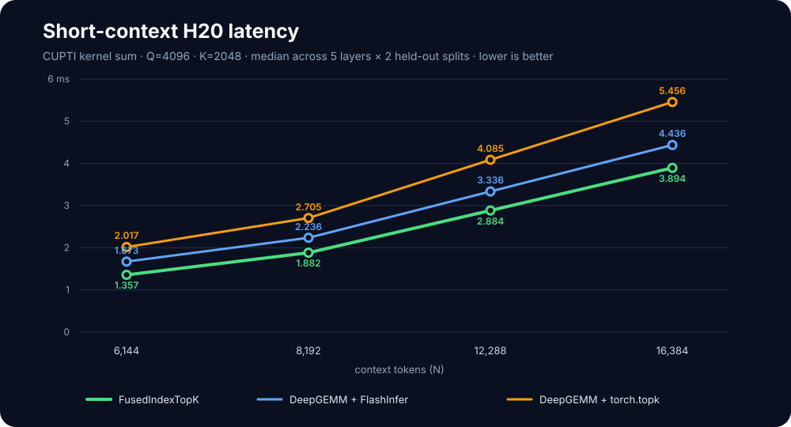

# FusedIndexTopK

> **Exact Top-K without materializing the dense `Q×N` score matrix.**

FusedIndexTopK is a high-performance fused Indexer and exact Top-K operator for
the **DeepSeek V3.2 sparse-attention architecture**. It combines
**DeepGEMM-style FP8 score production**, compact candidate generation, exact
radix selection, and device-side repair in one bounded-memory pipeline.

| Exact semantics | Fused dataflow | Reproducible evidence |
|---|---|---|
| Device repair handles fast-path underflow and overflow | Scores flow directly into compact candidates; no dense score matrix | Frozen H20 workload, CUPTI timing, CUDA Event guardrail, and held-out replay splits |

This repository is the clean research artifact: it contains the final operator,
the correctness and timing harness, and compact machine-readable results. It
intentionally excludes abandoned variants, raw profiler dumps, private machine
paths, model weights, and replay tensors.

## Why fuse Indexer and Top-K?

The conventional baseline writes a full score matrix to HBM and asks a separate
Top-K kernel to read it back. FusedIndexTopK keeps only promising score/index
pairs, reducing intermediate traffic while retaining exact output through a
device-masked repair path.



## Result at a glance

The workload is DeepSeek-V3.2-style prefill indexing with `Q=4096`, `K=2048`,
64 indexer heads, head dimension 128, FP8 Q/KV, FP32 scales/weights, causal
ranges, and unordered exact INT32 indices.

| Operator | Context N | Evidence status | Reduction vs DeepGEMM + FlashInfer |
|---|---:|---|---:|
| FusedIndexTopK | 6K–16K | gold, 5 layers × 2 held-out splits × 4 N | 14.71% median CUPTI; 40/40 cells won |
| FusedIndexTopK | 32K | development, layer 0 × 2 held-out splits | 7.55%–7.77% CUPTI |
| FusedIndexTopK | 64K | development, layer 0 × 2 held-out splits | 5.56%–5.70% CUPTI |
| FusedIndexTopK | 128K | development, layer 0 × 2 held-out splits | 4.87%–5.66% CUPTI |

FusedIndexTopK's median reduction versus the independent DeepGEMM +
`torch.topk` reference is 30.13% by CUPTI in the 6K–16K qualified range. Its
long-context repair uses bounded workspace, but the long-context evidence is
deliberately labeled development rather than gold.



*Each point is the median of the 10 published per-cell medians for that context
length: five model layers × two held-out replay splits. Values come directly
from [`results/fused-index-topk-short-context-h20-v1.csv`](results/fused-index-topk-short-context-h20-v1.csv).*

## How it works

The operator avoids materializing the dense score matrix. Its fast path:

1. estimates a conservative per-query threshold from deterministic random-token samples;
2. fuses score generation with compact candidate emission in a DeepGEMM-style persistent producer;
3. runs exact 9+7+8+8 radix selection over the compact candidates;
4. detects candidate underflow and overflow entirely on device;
5. repairs only flagged rows, preserving exact Top-K semantics.

The same public operator handles longer rows in 16K chunks.
Each chunk produces an exact local Top-2048, then an online exact pair merge
updates a fixed-size accumulator. No host flag read or dense `Q×N` score matrix
is required.

## Exactness and performance boundary

Exactness does not rely on the sampled threshold succeeding: detected fast-path
underflow or overflow is repaired on device. Performance does depend on repair
frequency and correlated failure-cluster size.

Across 640 held-out replay invocations (2,621,440 rows), repair triggered in
5 invocations, covering 9 rows total; the largest cluster was 3 rows. Forced
repair sweeps found the first P50 crossover against FlashInfer at 256–512 rows
for 16K and 128–256 rows for 32K/64K. The 128K boundary is approximately 128
rows. These observed natural clusters are far below the measured crossover,
but this is not a worst-case performance guarantee.

See [Results](docs/RESULTS.md), [repair analysis](docs/REPAIR_ANALYSIS.md), and
[methodology](docs/METHODOLOGY.md) for the claim boundaries.

## Repository map

```text
src/index_topk_perflab/
  experimental/fused_index_topk/
    plugin.py                 one public operator and dispatch
    producer.py               fused score/candidate producer
    candidate_reducer.py      exact compact-candidate radix reducer
    long_repair.py            fixed-memory long-context repair
    csrc/                     CUDA/JIT implementation sources
  variants/                   torch reference and FlashInfer baseline adapters
  benchmark.py, kineto.py     CUDA Event and Kineto/CUPTI timing
  correctness.py              exact score-threshold validation

configs/                      frozen H20 experiment contracts
scripts/                      benchmark, validation, and profiling entry points
results/                      compact public JSON/CSV evidence
tests/                        CPU control-plane and GPU lifecycle tests
```

The registry exposes one fused implementation, `fused_index_topk`. PyTorch and
FlashInfer remain only as correctness/performance references.

## Requirements

- NVIDIA H20/H100-class SM90 GPU;
- CUDA 13.0 for the qualified environment;
- Python 3.12 and PyTorch `2.10.0+cu130` for strict result reproduction;
- the pinned DeepGEMM and FlashInfer source revisions in [THIRD_PARTY.md](THIRD_PARTY.md).

CPU-only framework checks support Python 3.10–3.12 and do not import CUDA at
module import time.

The Python import namespace remains `index_topk_perflab` so published configs
and machine-readable artifacts retain their original identities.

## Quick start

Create the frozen GPU environment:

```bash
ITK_RUNTIME_ROOT=/data/$USER scripts/setup_h20.sh
```

Run local control-plane checks:

```bash
python -m pip install -e ".[test]"
make lint
make test
```

List the public variants:

```bash
python - <<'PY'
from index_topk_perflab.registry import available_variants
print(*available_variants(), sep="\n")
PY
```

Real replay tensors are not redistributed. Pass a locally generated replay
manifest to `scripts/benchmark_real_replay.py`; the manifest and input tensors
are hash-verified before use. See [Methodology](docs/METHODOLOGY.md) for the
dataset contract and reproduction levels.

## Reproducibility levels

- **Code reproduction:** build and validate FusedIndexTopK using synthetic inputs.
- **Protocol reproduction:** rerun the published timing/correctness procedure on
  another H20 using locally generated replay tensors.
- **Bitwise artifact reproduction:** requires the frozen private replay bytes;
  those tensors are not included in this release.

Published numbers are measurements, not universal hardware claims. Results on
other CUDA, PyTorch, DeepGEMM, FlashInfer, clock, power, or GPU configurations
must be reported as a new environment.

## License

Project code is released under the [MIT License](LICENSE). Dependency and
derivative notices are documented in [NOTICE](NOTICE) and
[THIRD_PARTY.md](THIRD_PARTY.md).
